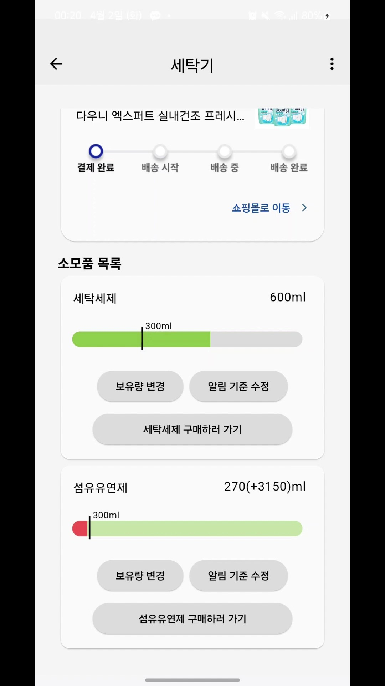
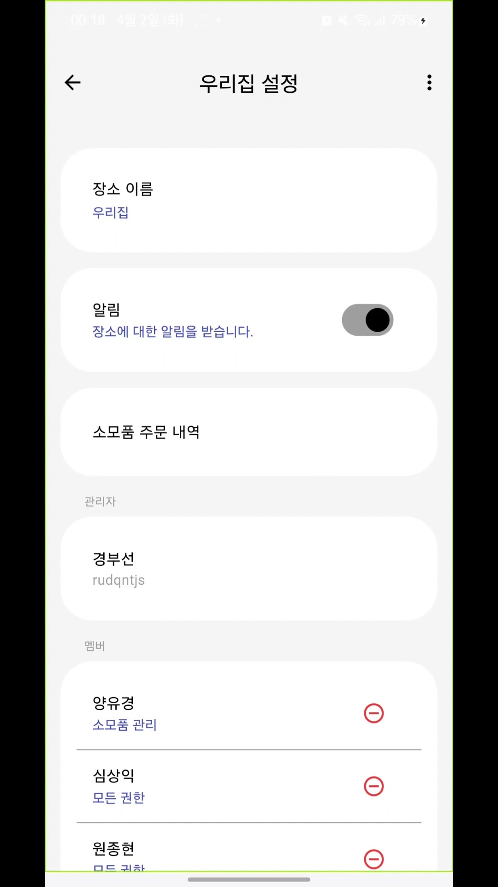

 
    
    <h2>소모아 프론트엔드</h2>

 

# 기술스택

|                        Flutter 3.19.3                         |                         Dart 3.3.1                         |
| :-----------------------------------------------------------: | :--------------------------------------------------------: |
|  |  |

# 화면설계

# 기능 및 화면구성

## 기기 스크린

✔️ 장소별로 기기를 그룹화하여 관리할 수 있음  
✔️ 장소 내 기기를 모아볼 수 있음  
✔️ 장소를 추가할 수 있음  
✔️ 기기 고유 번호(시리얼넘버)를 직접 입력하거나 QR 코드 스캔을 하여 기기를 등록할 수 있음

|                                   기기 탭                                   |                                  장소 목록                                  |                                 장소 추가                                 |                                    기기 등록                                     |
| :-------------------------------------------------------------------------: | :-------------------------------------------------------------------------: | :-----------------------------------------------------------------------: | :------------------------------------------------------------------------------: |
|  |  |  |  |

## 기기 상세 스크린

✔️ 기기 내 소모품의 상세 정보를 확인하고 구매할 수 있음  
✔️ 기기 내 소모품과 연관된 주문의 배송현황을 확인할 수 있음

|                                         공기청정기                                          |                                         세탁기                                          |                             소모품 보유량 변경                              |                                       관리가 필요한 소모품                                       |                                        소모품 예비 보유량                                        |
| :-----------------------------------------------------------------------------------------: | :-------------------------------------------------------------------------------------: | :-------------------------------------------------------------------------: | :----------------------------------------------------------------------------------------------: | :----------------------------------------------------------------------------------------------: |
|  |  |  |  |  |

## 소모품 스크린

✔️ 한 장소 내 소모품의 상태를 요약하여 확인할 수 있음  
✔️ 부족한 소모품을 구매할 수 있음

|                                   소모품 탭                                   |                                   소모품 구매                                    |
| :---------------------------------------------------------------------------: | :------------------------------------------------------------------------------: |
|  |  |

## 알림 스크린

✔️ 알림을 모아볼 수 있음

|                                   알림 탭                                   |
| :-------------------------------------------------------------------------: |
|  |

## 내 정보 스크린

✔️ 프로필을 확인하고, 본인의 주문내역을 확인할 수 있음

|                                  내 정보 탭                                   |
| :---------------------------------------------------------------------------: |
|  |

## 장소 관리 스크린

✔️ 장소와 관련된 알림을 켜고 끌 수 있음  
✔️ 멤버 권한 변경, 추가, 삭제할 수 있음

|                                 장소 관리                                 |
| :-----------------------------------------------------------------------: |
|  |
